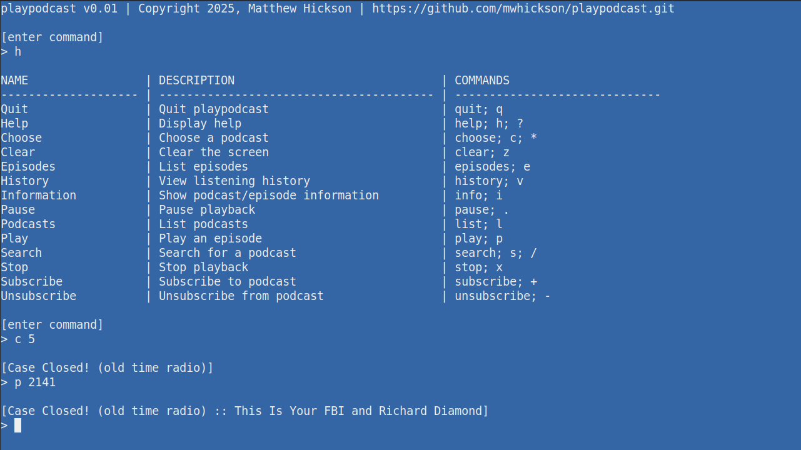

# playpodcast

## Overview

Having had some success with various platforms in the pursuit of the quintessential podcast player (for me), I found the least satisfying bit was the actual startup of, and control over playback.

To that end, I started with playback, and worked backwards to the UI I want to control things.

I almost gave up and let a webview take the brunt of the UI and playback handling (Go + Wails was promising in that regard); however, I don't really want a browser-based player.

Miniaudio and LibVLC appear to be the best options re: playback, and although the temptation to just use C/C++ and be done with it was high, I'm not particularly fond of the tooling for C/C++ (e.g. Make, CMake, Meson, vcpkg, etc.).

And so, I opted for LibVLC and C# (via LibVLCSharp).

Besides, it gives me the opportunity to use Terminal.GUI, which has also been an item on my TODO checklist.

UPDATE: And... maybe when Terminal.GUI v2.0 lands I'll give it another look. Until then, it's nice, but not for this.

Welcome to `playpodcast`!

## Features

- cache for http calls
- iTunes search
- OPML import/export
- streaming playback
- view podcast and episode detail

### Maybe...
- downloads for offline listening
- subscription management

## Tools

- LibVLCSharp : https://github.com/videolan/libvlcsharp
- Microsoft.Data.Sqlite: https://learn.microsoft.com/en-us/dotnet/standard/data/sqlite/?tabs=net-cli
- sqlite: https://www.sqlite.org/
- iTunes Search API : https://performance-partners.apple.com/search-api
- XML, RSS, OPML

## Screenshots

## License

[MIT License](LICENSE)
